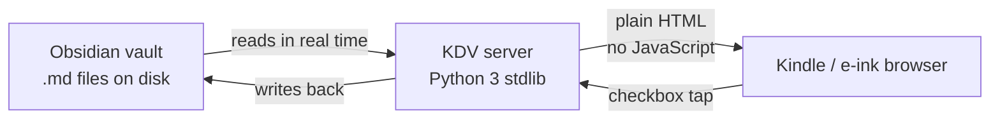

# Kindle Daily Viewer

Serve your Obsidian vault as plain HTML for e-ink browsers. No JavaScript, no external dependencies — just Python 3 stdlib.

Built for Kindle's experimental browser, but works on any e-ink device (Kobo, reMarkable) or regular browser.

## Features

- Daily note viewer with day/week/month/quarter/year navigation
- Git diff view (changed files, unpushed commits)
- Checkbox toggle — tap to flip `- [ ]` / `- [x]` in the actual markdown file
- Wiki link navigation — tap opens note in viewer + activates in Obsidian
- Obsidian active file button (reads workspace.json)
- Page-flip buttons (pure HTML anchors, no JS)
- Password auth with SHA256 cookie
- Strips dataview/dataviewjs blocks automatically

## Install

```bash
brew tap xinyun2020/tap
brew install kindle-daily-viewer
```

## Setup

```bash
# Create config
mkdir -p ~/.config/kdv
cp $(brew --prefix)/share/kdv/config.env.example ~/.config/kdv/config.env

# Edit — at minimum set KDV_VAULT
vim ~/.config/kdv/config.env
```

## Run

```bash
# Start manually
kdv

# Auto-start on login (pick one)
brew services start kindle-daily-viewer

# Or use the included LaunchAgent
cp com.kdv.plist ~/Library/LaunchAgents/
launchctl load ~/Library/LaunchAgents/com.kdv.plist
```

Then open `http://<your-mac-ip>:8080/` on your Kindle browser. Default password: `password`.

## Config

All settings via `~/.config/kdv/config.env` or environment variables:

| Variable | Required | Default | Description |
|---|---|---|---|
| `KDV_VAULT` | yes | — | Path to Obsidian vault |
| `KDV_DAILY_DIR` | no | `$VAULT/log` | Daily notes directory |
| `KDV_PORT` | no | `8080` | Server port |
| `KDV_PASSWORD` | no | `password` | Login password |
| `KDV_FEED_DIR` | no | `$VAULT/.trash` | Daily feed files |
| `KDV_WORKTREE_DIR` | no | — | Git worktree dir for diff view |
| `KDV_EXTRA_REPOS` | no | — | Comma-separated repo paths for diff view |
| `KDV_GITHUB_DESKTOP` | no | `false` | Auto-detect GitHub Desktop repos in diff view |
| `KDV_DIFF_TRUNCATE` | no | `50000` | Max diff bytes before truncation |

## Security model

KDV is a local-only server. It binds to your machine, serves your vault over your home network, and never contacts the internet. No accounts, no cloud, no telemetry, no external dependencies — your notes stay on your disk. Trust is local: anyone on your network with the password can read your vault, so use it on networks you trust.

## How it works



One Python file, zero dependencies. The server reads your vault, converts markdown to HTML, and serves it. Tap a checkbox on Kindle and it flips `- [ ]` / `- [x]` in the actual markdown file. Wiki links resolve note names by walking the vault directory.

## License

MIT
